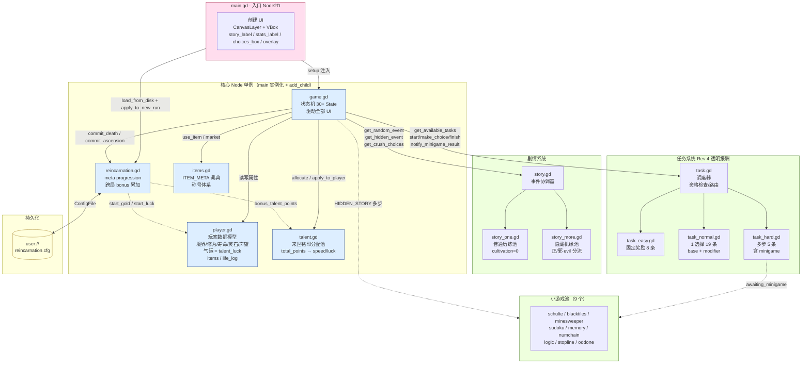

# 小狗修仙 — 系统架构图

**生成日期**：2026-05-07
**对应代码版本**：Rev 4 任务系统透明报酬制 + 转世遗赠 meta progression

## 总览

## 关键流向

### 启动序列（main.gd `_ready`）

1. 实例化 7 单例（player / story / task / talent / items / reincarnation / game）
2. `reincarnation.load_from_disk()` 读 `user://reincarnation.cfg`
3. `reincarnation.apply_to_new_run(talent, player)` 注入：
   - `talent.total_points = bonus_talent_points`
   - `player.gold = 40 + bonus_start_gold`
   - `player.talent_luck = bonus_start_luck`
4. 创建 UI（CanvasLayer + Margin + VBox + ScrollContainer）
5. `game.setup(...)` 注入所有依赖

### 局内主循环

- `game.gd` 状态机驱动，State 30+ 个（NAME_INPUT / TALENT_ALLOCATE / FACTION_SELECT / FREE / STORY / TASK_* / RETREAT_SELECT / BREAKTHROUGH_* / EXAM_* / MARKET / HIDDEN_* / CHRONICLE / GAMEOVER / REINCARNATION_CHOICE / ASCENSION）
- 每个 State 重绘 `story_label / stats_label / choices_box`
- 三大系统通过 game.gd 调度：
  - **player** — 数据模型（直接读写）
  - **story** — 事件 dict 返回，game 渲染
  - **task** — dispatcher 路由到 easy/normal/hard handler

### 死亡 / 飞升收尾

- 死亡 → `REINCARNATION_CHOICE` → 三选一 → `commit_death_choice` → save
- 飞升 → `ASCENSION` → 三项全拿 → `commit_ascension` → lives 重置 → save

### 小游戏双入口

- **隐藏事件**（`game.gd`）→ multi-step-events 协议 → 9 minigame 之一
- **困难任务**（`task_hard`）→ `awaiting_minigame` flag → game 拉起 minigame → `notify_minigame_result`

## 文件职责红线（CLAUDE.md 摘录）

| 文件 | Agent | 修改权限 |
|------|-------|---------|
| `story_one.gd` / `story_more.gd` | 剧情 Agent | 仅事件池数据；cultivation 必须 = 0 |
| `task_easy/normal/hard.gd` | 任务 Agent | 仅 TASKS 数组；cultivation 允许 > 0（境界上限 5/40/100/250/500） |
| `player.gd` / `game.gd` / `talent.gd` | 逻辑 Agent | 设计决策不得擅改 |
| `task.gd` | 调度器 | 任务 Agent 不得动 |
| `reincarnation.gd` | meta 单例 | ConfigFile 持久化 |

## Tuning Knobs 速查

- 突破系数 `talent_luck × 0.02 / pt`（player.gd:71）
- 闭关 insight 概率 `0.10 + talent_luck × 0.02`（clampf 0.03~0.30）
- 修罗门 `base.gold ×1.5`（数据填充阶段，handler 无分支）
- 死亡灵石继承 10% / 飞升 100%
- 转世奖励表 `REWARD_POINTS_BY_REALM = [0, 0, 2, 5, 10]` / `REWARD_LUCK_BY_REALM = [0, 0, 1, 3, 6]`
- 飞升固定奖励 `+20 points / +12 luck / 100% gold`
